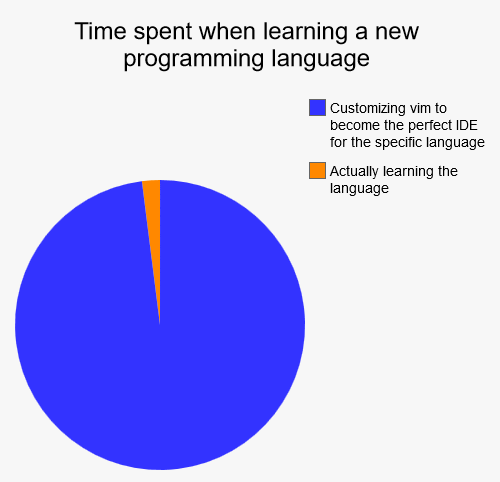

### 1. The Prefix

A year after buying this domain to blog on, without having written a single post, namesilo came asking me to renew. Paying that $7.99 stung a little — I'd sat on it for a year and done nothing with it.

### 2. The Curse

Setting aside my questionable writing, there were a few moments this past year when I actually felt the urge to write something. I even started a couple of times, but every one of them died on the vine. Looking back at why: at some point I started caring more about how much productivity my tools could give me than about actually producing anything. Tools that don't fit your hand make production cost more mental energy, and that makes you not want to produce at all. This chart from Reddit's vim board captures the state perfectly:

There are upsides and downsides to living like this. Take blogging:

Cons: every one of those urges this year got dropped because I didn't have a tool I was happy with. This time, after the renewal stung, I finally found one I like — Ulysses — and that's the only reason I could write this filler piece in the middle of a busy schedule (I wasn't busy; the filler part is true). Though inserting images is still not a smooth experience (

Pros: this tool also made me realize that collecting notes and organizing notes don't have to happen in the same app. So I'm dropping the extremely buggy Wiz Note I've been using and switching to Ulysses + Evernote. Here's hoping for a great leap forward in productivity (wait, that doesn't sound right

### 3. The Productivity

Section 2 was originally titled `Curse of Productivity`. Worried I'd misspelled something, I googled it — and found Observer's article [The Curse of Productivity][1], which describes roughly the same state I was in. So I just renamed the whole post to match. It cites the [Pareto principle][2]: 20% of the time gets you 80% of the productivity gain, and the remaining 20% of the gain costs the other 80% of the time — to the point where the time you save from being more productive may not even cover the time you spent getting there. I feel this in my bones. 80% of the time I've spent configuring vim went toward chasing that last 20%.

The article also argues that being too efficient makes you less creative. I don't buy that one. If higher productivity lowers the mental energy a task demands, then you have more mental energy left over for the creative things.

### 4. The End

This went downhill from the title, but that's enough rambling. Here's hoping I actually produce more this year — [Consume less, create more][3]!

> Look at this post — still writing about productivity!

[1]: https://observer.com/2014/02/the-curse-of-productivity-when-optimization-holds-you-back/
[2]: https://en.wikipedia.org/wiki/Pareto_principle
[3]: https://news.ycombinator.com/item?id=20781463
